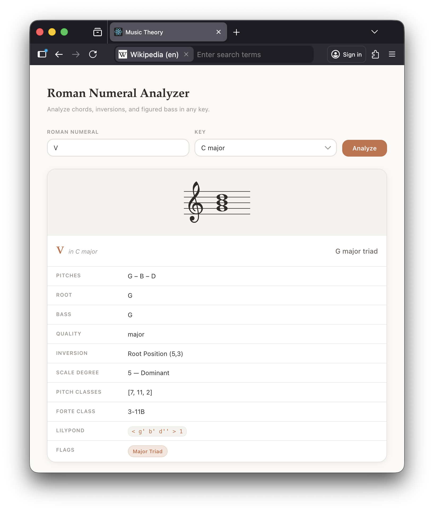

# Music Theory

A web app for analyzing Roman numeral chords. Enter a Roman numeral and key, and get back detailed chord analysis (pitches, inversions, figured bass, quality, etc.) along with a rendered score.



## Prerequisites

- [Docker](https://docs.docker.com/get-docker/) and Docker Compose
- [Node.js](https://nodejs.org/) (for the front-end)

## Getting Started

### 1. Start the back-end services

```sh
cd services
docker compose up --build -d
```

This brings up the gRPC microservices (music theory analysis, LilyPond rendering, schema registry) behind an Envoy proxy on **localhost:8080**. See [`services/README.md`](services/README.md) for more detail.

### 2. Start the front-end

```sh
cd music-theory-ui
npm install
npm start
```

The React app will open at **http://localhost:3000**.

### 3. Use it

1. Type a Roman numeral (e.g. `V`, `viio`, `IV6`, `bII`)
2. Pick a key from the dropdown
3. Click **Analyze** (or press Enter)

The app displays the rendered chord on a staff along with a detail table showing pitches, root, bass, quality, inversion, scale degree, pitch classes, Forte class, and LilyPond notation.